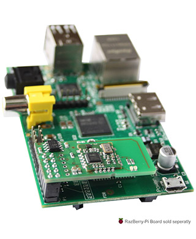
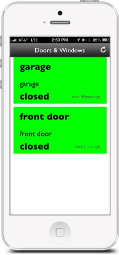
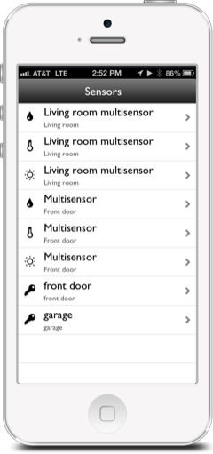
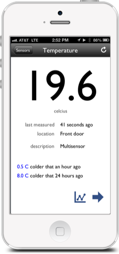
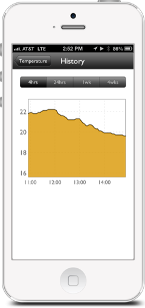
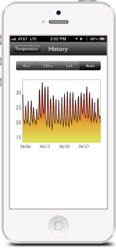
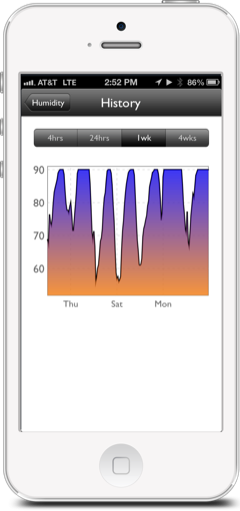
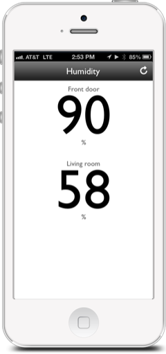
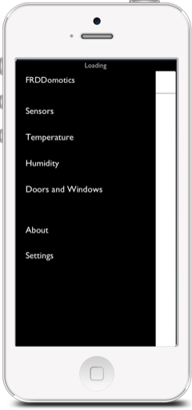
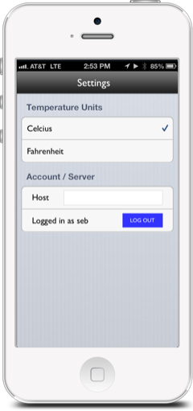

## Hardware

### A pi & a z-wave daughter card

[A raspbery pi](http://www.amazon.com/Raspberry-Pi-Model-Revision-512MB/dp/B009SQQF9C/ref=sr_1_1?ie=UTF8&qid=1372893768&sr=8-1&keywords=raspberry+pi) and a [z-wave GPIO daugther card](http://www.amazon.com/Z-Wave-Razberry-Pi-GPIO-Daughter-Card/dp/B00BL9QFH6/ref=pd_rhf_se_p_t_2_TJ5S).



The ZWave controller is the small card on top of the pi, it costs about twice as much as the pi.

### Assortment of z-wave sensors

My setup currently includes 2 [aeon labs multi-sensors](http://www.amazon.com/Aeon-Labs-DSB05106-ZWUS-Z-Wave-Multi-sensor/dp/B008D5TYGU/ref=sr_1_fkmr0_1?ie=UTF8&qid=1372893939&sr=8-1-fkmr0&keywords=insteon+multi-+sensor) (temperature, humidity and luminosity), 1 [aeon labs door/window sensor](http://www.amazon.com/Aeon-Labs-Z-Wave-Window-Sensor/dp/B004ETD4VU/ref=pd_sim_hi_4) and one [Schlage door/window sensor](http://www.amazon.com/Schlage-RS100HC-SL-Window-Intelligence/dp/B008Q5CTBE/ref=pd_sim_hi_1).


## Back-end

Mostly a MEAN stack, even though I am running node static instead of express to serve my angularJS test UI.

### Two nodeJS instances

The first one (proxy.js) is running <a href="https://github.com/nodejitsu/node-http-proxy">node Jitsu node-http-proxy</a> for node JS and a node static/<a href="http://angularjs.org/">AngularJS</a> test web app.

    $ node proxy.js
    https proxy server started on port 8000
    proxy routing:
    https://host:8000/api/{path} -> http://host:8081/{path}
    https://host:8000/{path} -> http://host:8080/{path}

This server is also running a task that listens for events from the Z-Wave daemon installed on the raspberry PI, it records changes pushed from the sensor to the database (a mongoDB instance), runs the APN (Apple Push Notification) logic and eventually pushes the notification out to the iPhone.

The second one is running the REST API, implemented using <a href="https://github.com/mcavage/node-restify">node restify plugin</a>.


    $ node api.js


### Security

The proxy server is by default listening on port 8000 and HTTPS is enabled both for the HTML server and the API REST server.
I curently am using a self signed SSL certificate, use the -k option if you'd like to try the API with CURL.

    $ curl -u username:password -k https://ipaddress:8000/api/about
    {
        "name": "FRDDomoticsAPI",
        "nodeVersion": "v0.8.8",
        "startDate": "2013-07-05T03:39:18.292Z",
        "versions": "0.1.0"
    }

Read the README.md in the crypto subfolder to generate your own self-signed certificate or use a proper one if you have
one...

In addition of SSL, all API requests are authenticated using HTTP Basic-Auth. The password and username passed in the HTTP
header are matched with data contained in the users folder. I decided to not use
the database to store user data but to store for each authorized user a blob of data that consists of a SHA512 hash of ```"FRDDomotics-' + username + password```, one file per user.

Files are created from the comnand line using the ```genpwd.sh``` script and data in the HTTP header are matched against 
data in those files. Checkout the Readme.md file in this folder.

### MongoDB

I am using a mongodb instance that I access with [mongoose](http://mongoosejs.com) ODM.
This is wrapped in the FRDDomoticsStorage.js file. 

### Push Notifications

FRDDomoticsAPN.js is wrapping the [node-apn](https://github.com/argon/node-apn) node module. Curently hard coded to send
one push notification to only one device (my iPhone) each time my front door or garage door are opened of closed.

## Front end: A __NATIVE__* iPhone App

I saved this in a separate repo [iFRDDomotics](https://github.com/sebastienwindal/iFRDDomotics/).

To compile the project you will need [cocoapods](http://cocoapods.org/) installed on your machine and run 
the ```pod install``` from the project main folder.

Various notable libraries the app is using:

* REST client: I am not the big fan of RestKit so I am using a more lightweight solution that consists of [AFNetworking](https://github.com/AFNetworking/AFNetworking) to perform HTTP requests and [Mantle](https://github.com/github/Mantle) as a model layer.
* [NUI](https://github.com/tombenner/nui): The app appearance is customizable using CSS-like declaration, see them.nss file.
* [MMDrawerController](https://github.com/mutualmobile/MMDrawerController): The excellent Side Drawer Navigation Controller from [mutual mobile](http://www.mutualmobile.com/).
* All icons are using icon fonts using the [icoMoon](http://icomoon.io/) app and my own [iOS script](https://github.com/sebastienwindal/IOSIcoMoon) to easily use the font in the app.


Few screen shots:












(*) F..k YEAH.